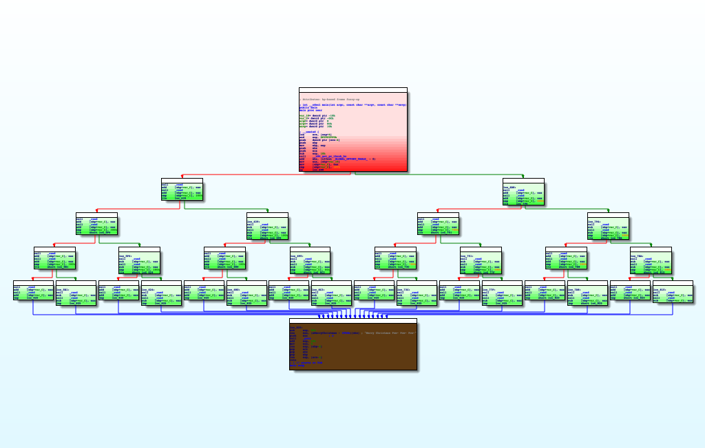
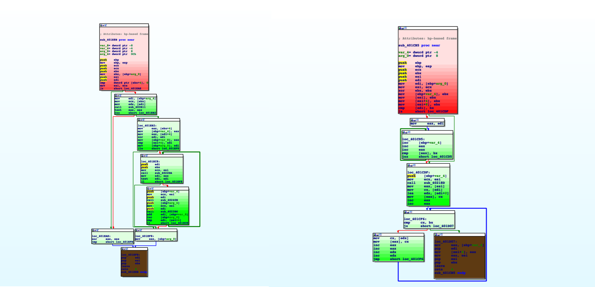

Update: This project won Special Technology Award and $30 reward in POW Hackathon 2021.

## ☃️ IDAChristmas
IDAChristmas is IDA-Pro coloring plugin brings christmas mood into IDA-View. 
> Do you wanna build a christmas tree? 🎶  
> Do you wanna enjoy christmas mood while doing work? 

*Then, use **IDAChristmas** plugin!*

 

## 📁 How to run it? 
> Open IDA > [File] > [Script File] > Select IDAChristmas.py > [Open]

 

## ⌨️ Keyboard shortcut
> | Key | Discription | 
>|-----|-------------|
>|  '  |Make current IDA-View into christmas tree🎄 | 

 

## 🎄 Enjoy IDAChristmas tree

> Try using it with *The most Christmastree-alike program* [tree](./sample/tree.c).  
> * target binary: [tree](./sample/tree.c)    
>   
>   
> * target binaery: utorrent.exe    
> 
> *(Christmas tree can be looks little bit weird depending on target binariy.)*

  

## 🎥 User guide video 

> 
